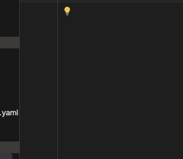
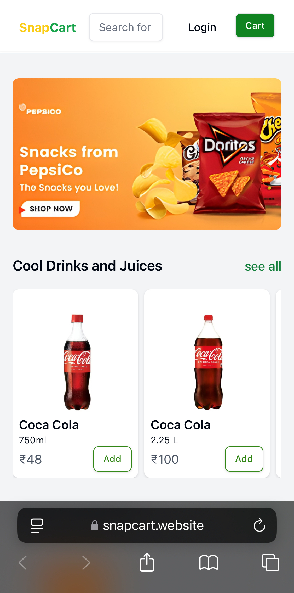

# SnapCart 🛒

SnapCart is a quick delivery website for groceries and foods, designed to provide users with a seamless shopping
experience. It focuses on efficiency, scalability, and user satisfaction.

---
images:

<div style="display: flex; flex-direction: column; justify-content: center; align-items: center; gap: 20px;">
  
  
</div>

---

## Features ✨

- **Quick Delivery**: Lightning-fast grocery and food deliveries.
- **Variants Management**: Easily manage product variants on a single product page.
- **Role-Based Access Control**: Admin, seller, and user roles with tailored functionalities.
- **Secure Authentication**: Includes OTP verification for enhanced security.
- **Banner Management**: Manage promotional banners to enhance user engagement.
- **Cart System**: Efficient and scalable cart system using a dedicated collection for better performance.

---

## Tech Stack 🛠

**Frontend**:

- React
- Redux (for state management)
- Tailwind CSS (for styling)

**Backend**:

- Node.js
- Express.js
- MongoDB
- Redis

**Other Tools**:

- TypeScript (strong typing)
- Axios (API communication)
- Docker (containerization for deployment)
- Nginx (reverse proxy)

---

## Installation 🚀

### Prerequisites

- Node.js (v18 or higher)
- MongoDB (Community version 7.0 or higher)
- Docker & Docker Compose

### Clone the repository

```bash
git clone https://github.com/<your-username>/snapcart.git
cd snapcart
```

## Docker Deployment 🐳

To deploy the entire application using Docker, ensure docker-compose.yml is configured correctly, then run:

```bash

docker-compose up --build

```

## API Endpoints 🌐

### Authentication

	•	POST /api/auth/signup - User signup
	•	POST /api/auth/login - User login
	•	POST /api/auth/verify-otp - OTP verification

### Products

	•	GET /api/products - Fetch all products
	•	POST /api/products - Add a new product (Admin only)

### Variants

	•	GET /api/variants/:productId - Fetch variants of a product
	•	POST /api/variants - Add variants to a product

### Cart

	•	GET /api/cart - Fetch cart items
	•	POST /api/cart - Add items to cart

---

## Project Structure 📂

```bash
snapcart/
  │
  ├── backend/         # Server-side code
  ├── frontend/        # Client-side code
  ├── shared/          # Shared types for backend and frontend
  ├── docker-compose.yml
  └── README.md        # Project documentation
```

---

Contact 📧

For inquiries, please contact:
Rahil Sardar
Email: rahilsardar234@gmail.com